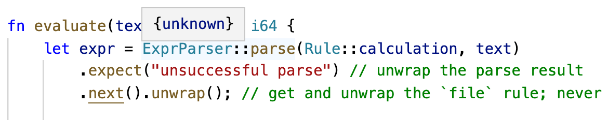

# Notes on Advent of Code 2020

## Day 20

Today was pretty rough! I think my whole approach was more or less fine, it was just a slog to implement all the rotations and flips. I wound up writing out all the transformations (flips + rotates) on paper to make sure I got them right. After yesterday's experience, I was being careful.

The one clever thing I did was checking how many possible neighbors there were for each cell. For both the sample and my input, there were exactly four tiles with only two possible neighbors. Since part one only required the product of the tile IDs in the corners, that was enough. I didn't have to solve the puzzle to get my star. So I beat Jack and Jeremy to the first star!

For the second part, I figured I could pick an arbitrary corner tile as the top left and figure out how to attach the neighbors to its right and bottom. That would set the orientation for the whole puzzle. Then I could push out my solution diagonally towards the bottom right. This worked great, it just took me a while to implement and get it right.

In retrospect, I should have just stored the cells in a tile and made `left()`, `right()` etc. be methods. This didn't wind up being a performance-sensitive problem.

Rust notes:
- Wrote macros for `map!` and `set!` literals in `util.rs`. For some reason these are `aoc2020::map` and not `aoc2020::util::map`.
- It's confusing to me when you can do `for &x in ...` and when you can't.
- `.collect`ing an iterator of pairs into a hash map is a pretty neat pattern.
- I think "Missing lifetime annotation" errors don't show up in VS Code and prevent any other errors from showing up, either.

## Day 19

I half expected my part one solution to work for part 2, but I think it would require not being greedy.

I thought about implementing some sort of lookahead to ensure that each instantiation of a rule consumed at least one character. But then I looked at the recursive rules and realized that there was a much simpler pattern. You need some 42s, and then a smaller number of 31s.

At this point I felt pretty confused! I flet like I'd figured it out, but couldn't see how their matching worked out for the sample. I kept getting a smaller number of matches.

Eventually I tracked it down to a bug in my code that found all the strings that matched a rule. I'd changed a `pieces[0]` to `pieces.pop()`, which had the effect of permuting some of the matches. It didn't throw me off enough to prevent the key insight to solve the problem (rules 31 and 42 match disjoint strings of the same length) but did give me confusingly-wrong answers.

This one definitely took me the longest! As usual, more thorough unit tests might have caught the bug. I just thought I was misinterpreting the rules.

On the plus side, I used my first lifetime annotation today!

    fn match_str<'a>(&self, txt: &'a str, rules: &HashMap<i32, Rule>) -> Option<&'a str> {

This consumes a `str` and returns a slice of it, so they have the same lifetime.

I also learned about `r#""#`-style strings, which allow `"` characters in the raw string.

Two issues I ran into today:

- The borrow checker error that led to the signature above didn't show up in VS Code, even after restarting the Rust server. It only showed up as an error when I ran the program.
- I'm getting quite annoyed at errors showing up after extremely long documentation strings. You have to scroll all the way down through several pages of text to see the error. And if you scroll even a pixel too far, the whole dialog goes away.

There's no nice syntax for map or set literals (see [RFCs #542][542]) but it's pretty easy to write a function to make this more pleasant. You can also make a macro to do this, though the issue of `&str` vs. `String` seems worse there. Macros seem pretty cool! I'd like to see what else people use them for.

## Day 18

One of my project ideas for learning some Rust was implementing an answer to [this question][cbc], a command-line calculator that ignores commas and dollar signs. I'd poked around at [pest][] a month ago, but it was a bit beyond my Rust abilities at the time. While a full parser generator is a bit overkill for this problem (certainly for part 1!) this seemed like a good opportunity to try again. I was pleasantly surprised that it was much easier to get it working this time. I must have learned some Rust in the past month!

There's a lot of macro magic involved in Pest. It works, but one downside is that you completely lose the types in your editor:




## Day 17

The trick I learned [last year][2019] of representing grids using maps from coordinate tuples to values made this one a lot easier! Almost no change from part 1 to part 2. The only trick was making sure you considered the next state for all _neighbors_, not all cells.

Was nice to learn that you can use `lazy_static!` to fill a vector. This makes enumerating all the combinations of -1, 0, +1 for directions a lot less error-prone than writing them by hand:

```rust
lazy_static! {
    static ref DS: Vec<(i32, i32, i32, i32)> = {
        let mut v: Vec<(i32, i32, i32, i32)> = vec![];
        for dx in -1..=1 {
            for dy in -1..=1 {
                for dz in -1..=1 {
                    if dx != 0 || dy != 0 || dz != 0 {
                        v.push((dx, dy, dz, dw));
                    }
                }
            }
        }
        assert_eq!(26, v.len());
        v
    };
}
```

I don't know if there's any downside to representing the directions this way vs. as `[(i32, i32, i32); 26]`. You can make either work, the latter just requires a little more care.

## Day 15

Slightly annoying to avoid off-by-ones, but after that this was quite fast. I was happy that you can get away only storing the last round for each number, as opposed to the previous two or N. I wonder if the 30,000,000 rounds in step 2 is a problem if you implement this in a slow way, or in Python? It took ~2 secs with Rust:

    $ cargo run --release --bin day15 0,20,7,16,1,18,15 30000000
    Compiling aoc2020 v0.1.0 (/Users/danvk/github/aoc2020)
        Finished release [optimized] target(s) in 0.52s
        Running `target/release/day15 0,20,7,16,1,18,15 30000000`
    nums: [0, 20, 7, 16, 1, 18, 15]
    last spoken: 129262 after 30000000 rounds (2317 ms)

I was curious so I ported my solution to Python. It's ~6x slower:

    $ time python3 py/day15.py 0,20,7,16,1,18,15 30000000
    After 30000000, last_spoken=129262
    python3 py/day15.py 0,20,7,16,1,18,15 30000000  13.51s user 0.18s system 99% cpu 13.721 total

You read everywhere that Rust's default hasher for HashMap is "known to be slow for small keys like ints." I swapped in `rustc_hash::FxHashMap` but didn't get too much of a speedup, only down to ~1.7 secs.

Switching from a `HashMap` to a long `Vec` had a bigger impact on performance, getting me down to 688ms.

## Day 14

This one wasn't very challenging, just had to work it out and get all the bit shifting and masking right. I used a loop from 0..2.pow(n) to iterate over all possible combinations for the "floating" bits in part 2. I was wondering if Axl would come up with some Rust standard library function for this, but apparently not.

One thing I was surprised by in Rust: there's a big distinction between an enum, which is a type, and a _variant_ of the enum, which is not. So while I can declare:

    let mask: Op = ...;

I cannot declare:

    let mask: Op::Mask = Op::Mask { ... };

Not really clear to me why you wouldn't want to allow this. It works great in TypeScript.

Another thing I learned: to ignore a field while destructuring / matching, you assign it to `_`:

    Op::Mask { ones, zeros: _, xs }

## Day 13

Relieved that I didn't overflow u64 today! My modular math is quite rusty (I took college Algebra in… 2003?) so while I was pretty confident there was a canonical solution to a system of equations over different moduli, I didn't remember exactly what it was. I was pretty confident that I could solve subproblems by figuring out what the number was mod p1*p2 if p1 and p2 were relatively prime.

I _was_ able to come up with an answer this way, but unfortunately it wasn't the smallest answer on the sample problem. I got:

    // primes: [(59, 4), (31, 6), (19, 7), (13, 1), (7, 0)]
    n = 2093560 (mod 3162341)

but the solution was 1068781. I noticed that this was close to the difference of those two numbers, so I tried it… and `3162341 - 2093560 = 1068781`! So I tried this on the big problem and it worked.

Looking back at this, I had the congruences messed up. If you want bus 19 to show up one timestamp after bus 7, then you need n + 1 = 0 (mod 19), not n = 1 (mod 19). That explains why I had the answer exactly backwards! My solution did work, I was just solving the wrong problem. In retrospect, writing more tests on small inputs would have helped me find this.

There are very efficient ways to calculate the multiplicative inverse of a number mod a prime, but my brute force solution worked fine in practice.

Apparently this problem is just the Chinese Remainder Theorem. One other wrinkle that tripped me up: because of the way the problem is constructed, sometimes the residue was larger than the prime. So you have to do some addition / modulus in the problem setup, too.

## Day 12

Hopefully continuing the pattern of easy puzzles on the weekend. I woke up early and wanted to do AoC, so this wound up being my best result so far (17726 / 14724 — tough to get a top result on the east coast!).

A few things of note:

- (-90) % 360 = -90 in Rust
- I wanted to write `(dx, dy) = (-dy, dx)` to rotate 90°, but was referred to https://github.com/rust-lang/rfcs/issues/372
- Storing the waypoint delta, instead of its absolute position, wound up being a good choice.

## Day 11

My code for part 1 worked just great on the sample code, but produced an incorrect answer on my input. A bug! These tend to be quite frustrating with AoC since you only know the correct output for what they give you. I tried a few different things but to no avail. My unit tests were passing but I was producing the wrong answer.

I eventually got frustrated and reimplemented the whole thing in Python. It only took maybe 10 minutes. It gave me the correct answer and, more importantly, correct intermediate states to compare against my broken Rust program. As it turned out, while the sample input was square (10x10), my personal input was slightly off-square (92x91). Sneaky! And I'd made an assumption about a square grid in one part of my code. Once I fixed the bug, part two was pretty easy.

Jack said he had a unit test for a 3x2 grid. In retrospect that would have been a good way to do it, too. Unit tests for slightly higher level functions than "count your neighbors".

Notes from Axel's code:

- There's an `unreachable!()` macro you can use instead of `panic!("reason")`.
  Not exactly sure why you'd prefer this.
- He used `get` and `and_then` to chain map lookups. I was looking for `and_then`!
  I tried using `map_or` but ran into some bugs that I couldn't figure out.
  I wound up rewriting this in a more imperative style.
- He also wrote out an eight-element tuple of directions (`DS`).
  This was a source of confusing bugs for me, as I had a duplicate / missing entry in mine.
- Axel tends to separate his `as i64` from his `as usize`, the latter only appearing at the
  place where you index into an array.
- Using `|&&x|` in a lambda is OK.
- Apparently you can do this (`i` and `j` being parameters):

    let (mut i, mut j) = (i as i64, j as i64);

It's not always clear to me when you need to write `.iter()` before `.map()` and when you can
just write `.map()`. Or when you need to write `.collect()`. Why do I have to `.collect()` an
iterator of `String`s before calling `join()`?

You can use `use EnumType::*` to drop the need to qualify its contituents.

## Day 10

Part two was the first puzzle where brute force was too slow. My first instinct was to do the search from both sides, to sqrt the runtime. But getting the join condition just right is tricky. Then I realized there are some joltages that you _have_ to go through. So those are the natural breakpoints. From there it was a fight with off-by-one errors.

One thing I find confusing about Rust iterators... why is the type of `x` here `&i32` and not just `i32`?

    let jolts: &[i32];
    jolts.iter().map(|x| x);

## Day 9

Got tripped up a bit by `.combinations()` not working as I'd expected:

```rust
fn is_pair_sum(n: u64, nums: &[u64]) -> bool{
    // TODO: why can't I make the lambda look like: |(a, b)| a + b == n?
    nums.iter().combinations(2).any(|x| x[0] + x[1] == n)
}
```

The `x` here is `Vec<&u64>`. Looking at Axl's code, it turns out that I need to use `tuple_combinations` instead:

```rust
fn is_pair_sum(n: u64, nums: &[u64]) -> bool{
    nums.iter().tuple_combinations().any(|(a, b)| a + b == n)
}
```

Why would I ever _not_ want `tuple_combinations`? It feels a little magical to me that `tuple_combinations` is able to infer the `2` from the signature of the `any` callback. How does that work?

I had to switch from `i32` to `i64` for accumulating. (I got an overflow panic, which was much more helpful than the incorrect results you'd get in C.) I'm nervous what will happen if I need to go higher than that. I remember that Python's bigints were quite helpful for last year's IntCode computer.

The constant conversions between `i32` and `usize` for indexing are pretty annoying. You need a `usize` to index. But if you ever want to subtract one, you need to convert it to an `i32` first. Hence this grossness:

```rust
is_pair_sum(n, &nums[(i as i32 - preamble_len) as usize..i])
```

Iterating from short subsequences to long makes a huge time difference, even though both are O(N^3):

    Time: 2961ms
    Time: 7ms


## Day 8

Our first problem involving implementing a computer. Switching from a struct:

```rust
struct Instruction {
    op: String,
    arg: i32,
}
```

to an enum:

```rust
enum Op {
    Nop(i32),
    Acc(i32),
    Jmp(i32),
}
```

moved more logic into the parsing but simplified everything downstream. It does feel odd to me that I can't name the parameters in each case of the enum (`arg: i32` instead of just `i32`).

I learned about `filter_map`, which combines `map` with unwrapping `Option`s. This seems great, but I haven't been able to use it yet because I usually want to unwrap `Result`s.

## Day 6

I was able to reuse the chunking code day 4 to make short work of this.

I'm still puzzled at why it's so difficult to factor out functions that work with Iterators in Rust. It seems very easy to get into situations where the return type involves closures that can't be written in the type system, or to get into trouble with the borrow checker.

I looked for a functional way to do "count by" on the characters in a string but wasn't able to find anything.

## Day 5

I was feeling some social pressure to get out the door this morning, so I just did this one with find/replace, `sort`, `bc` and a spreadsheet.

    (echo 'ibase=2'; cat inputs/day5.txt | perl -pe 's/B/1/g; s/F/0/g; s/R/1/g; s/L/0/g;' | sort) | bc | pbcopy

## Day 3 & 4

Rust is feeling… kind of annoying! My usual procedure for fixing errors is throwing `.unwrap()`, `&`, `String::from()` and `into_iter()` into the expression until it works.

It would be useful to find a Rust expert who's also doing the Advent of Code.

https://github.com/RoccoDev/aoc-2020/blob/master/src/days/day4.rs
https://github.com/AxlLind/AdventOfCode2020/blob/master/src/bin/04.rs
https://github.com/SamMorrowDrums/aoc2/blob/day4/day4/src/main.rs
https://gist.github.com/samueltardieu/9d61cca5c6366f98e43f5719c3ae86b5
https://gist.github.com/whiter4bbit/220d30f3278b0077a08c4f28b8047eee

AxlLind's is particularly clean. I like the itertools approach, though my attempt
to factor out a helper function to separate the file's lines into blank line-delimited
"chunks" failed spectacularly. The return types for Iterators get way too complicated, and
you can't copy them from error messages because they reference closures.

The `lazy_static!` construct seems to break inference in vscode when you use it inside a
function, but not when you use it at module-level. Weird.

## Day 2

First time using regexes in Rust. Overall it seems... mostly reasonable? I got thrown off by a few things:

1. `.captures()[0]` is the full match, and `.captures()[1]` is the first capture.
2. The docs suggested using `lazy_static!` to initialize the RE once rather than in a loop, but this seemed to break type checking in VS Code.
3. ~The [docs][re] don't escape backslashes in regexes, but it seems you need to in your own code.~ Scratch that, they're using raw strings, which look like `r""`.

Also first time using `HashMap`, though in retrospect I only did this because I misinterpreted the question. The "Entry API" seems quite important. The borrow checker makes things like "iterate over all the keys and values in a hash map" surprisingly hard.

Indexing a string is also [pretty annoying][2]. I suppose this is annoyingingess that's hidden in other languages by their being slow, due to Unicode.

## Day 1

I still find Rust's module system incomprehensible.

The issue this time turned out to be that I needed to import my util library as:

    use aoc2020::util;

rather than any of these:

    use crate::util;
    use super::util;
    use super::super::util;


[1]: https://stackoverflow.com/questions/60993657/cross-module-function-call-in-rust
[2]: https://stackoverflow.com/questions/24542115/how-to-index-a-string-in-rust
[re]: https://docs.rs/regex/1.4.2/regex/
[2019]: https://medium.com/@danvdk/python-tips-tricks-for-the-advent-of-code-2019-89ec23a595dd
[cbc]: https://softwarerecs.stackexchange.com/q/75993/69199
[pest]: https://pest.rs
[pest-intro]: https://pest.rs/book/intro.html
[542]: https://github.com/rust-lang/rfcs/issues/542


